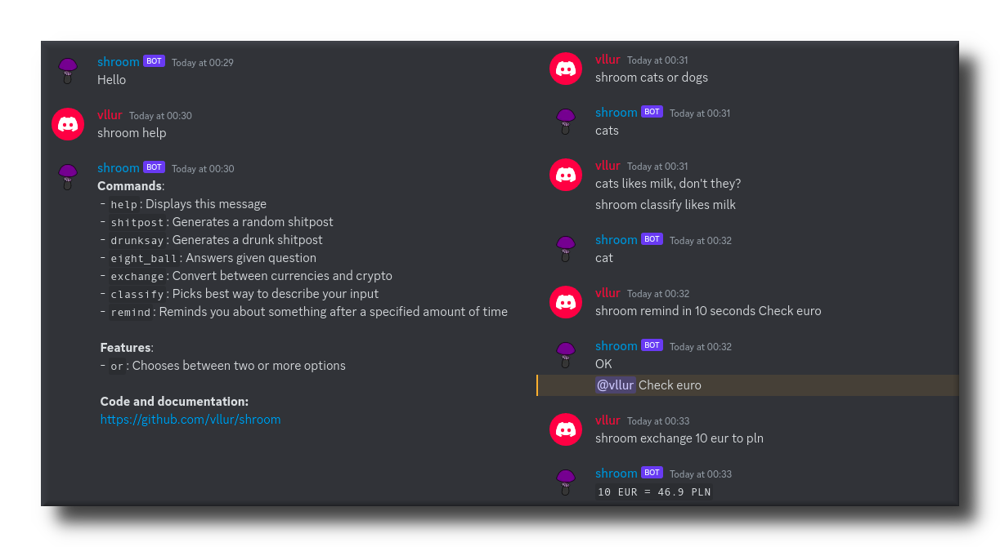

<h1>shroom</h1>

<p>
<a href="https://github.com/crystal-lang/crystal"></a>
<a href="https://github.com/vllur/shroom/blob/master/LICENSE"></a>
</p>

<p>
General purpose Discord bot, focused on bringing functionality to your server. Ask about anything, let it remind you about scheduled tasks or check currency exchanges.
</p>
<p></p>



<!-- TOC -->

- [Installation](#installation)
  - [Configuration](#configuration)
  - [Running with Docker](#running-with-docker)
  - [Running with Crystal](#running-with-crystal)
- [Usage](#usage)
- [Development](#development)
  - [Project structure](#project-structure)
  - [Adding a command](#adding-a-command)
  - [Making a Pull Request](#making-a-pull-request)
- [FAQ](#faq)
- [Contributors](#contributors)

<!-- /TOC -->

## Installation

### Configuration

First, you need to obtain [Discord API](https://discord.com/developers/applications) token and [ID](https://support.discord.com/hc/en-us/articles/206346498-Where-can-I-find-my-User-Server-Message-ID-) of main (or #random, etc.) channel in your Discord server. You will also need to add a bot to your application and get its Application ID.

Now you can copy Discord API token and channel ID to `_config.yml`:

```yaml
# Discord token
token: "TOKEN"

# Channel ID 
channel: 123
```

Next, to add your bot to server go to <a href="https://discord.com/oauth2/authorize?client_id=APPLICATION-ID&scope=bot&permissions=8">https://discord.com/oauth2/authorize?client_id=APPLICATION-ID&scope=bot&permissions=8</a> address in your browser, substituting APPLICATION-ID with your bot's Application ID.

Now you can either click `Download` and then `Download ZIP` at the top of this page, or type `git clone https://github.com/vllur/shroom.git` in terminal.

You probably want to further edit `_config.yml` to configure the bot to your liking.

### Running with Docker

You only need to have `docker` and `docker-compose` commands available. Then simply:

```sh
docker-compose up
```

### Running with Crystal

If you have Crystal installed:

```sh
shards install
shards build
./bin/shroom
```

Optimized binary can be produced by adding `--release` and `--no-debug` flags to build command. This is a good method for smaller servers, as ~30 MB will be sufficient for the bot process.

Alternatively:

```sh
shards install
crystal ./src/shroom.cr
```

## Usage

Bot react on every chat it sees and have write access to, if message begins with `prefix`.

Currently available commands:

- `help` - writes a brief help message
- `shitpost` - generates a random shitpost
- `drunksay` - generates a shuffled shitpost
- `eight_ball` - answers given question with configured answers
- `exchange` - converts between currencies and crypto
- `classify` - decides which configured answers suit the input best
- `remind` - reminds you about something after a specified amount of time

## Development

Issues and pull requests are welcome! Make sure to first post an issue to discuss your ideas before commiting to fully making a feature.

### Project structure

```
├── _config.yml
├── shard.lock
├── shard.yml
├── spec
│   └── [...]
└── src
    ├── shroom
    │   ├── actions
    │   │   ├── act_on_message.cr
    │   │   ├── act_on_ready.cr
    │   │   └── [...]
    │   ├── commands
    │   │   ├── help.cr
    │   │   └── [...]
    │   └── config.cr
    └── shroom.cr
```

- `_config.yml` - holds all configuration, translatable strings and messages
- `src/shroom.cr` - main file, holds `Bot` class and runs the bot
- `src/config.cr` - `Config` class is responsible for loading configuration
- `src/actions/*` - each file represents actions to be taken on certain event, exposed by `Discordcr`
- `src/commands/*` - one bot command per file

### Adding a command

Adding new command is quite simple. First, think about a name and configuration options your command might want to have. For example:

```yaml
commands:
  [...]
  my_command: "my_command"

[...]

my_command: "test!"
```

Next, lets load the configuration. Open `shroom/config.cr` and add following to the rest of getters:

```crystal
getter my_command : String
```

In the `initialize` function declaration also add the parameter:

```crystal
[...], @my_command : String, [...]
```

Next, register your command in `shroom/actions/act_on_message.cr`:

```crystal
when config.commands["my_command"]
  Shroom.my_command()
```

You can pass anything your command will need to this function. For example, `client`, `config` or `message`.

Now to create the file to hold your code - `shroom/commands/my_command.cr`:

```crystal
module Shroom
  def self.my_command()
    puts "Test!"
  end
end
```

And if you rerun (or recompile), you will notice that writing `shroom my_command` in Discord chat results in `Test!` in terminal output.

### Making a Pull Request

1. Make a fork (<https://github.com/vllur/shroom/fork>)
2. Create your feature branch (`git checkout -b my-new-feature`)
3. Commit your changes (`git commit -am 'Add some feature'`)
4. Push to the branch (`git push origin my-new-feature`)
5. Create a new pull request

## FAQ

- `Q`: Configuration file is present, but the bot can't find it, what's wrong?
- `A`: Configurations location is relative to current working directory, so `cd` first to where your configuration is.

## Contributors

- [vllur](https://github.com/vllur) - creator and maintainer
